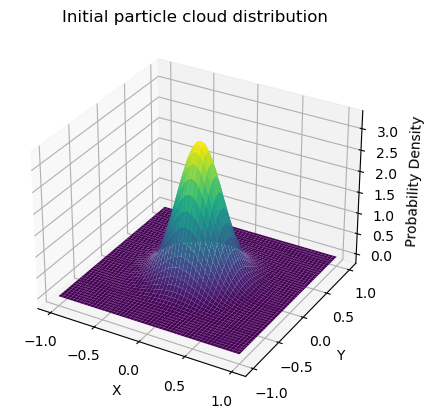
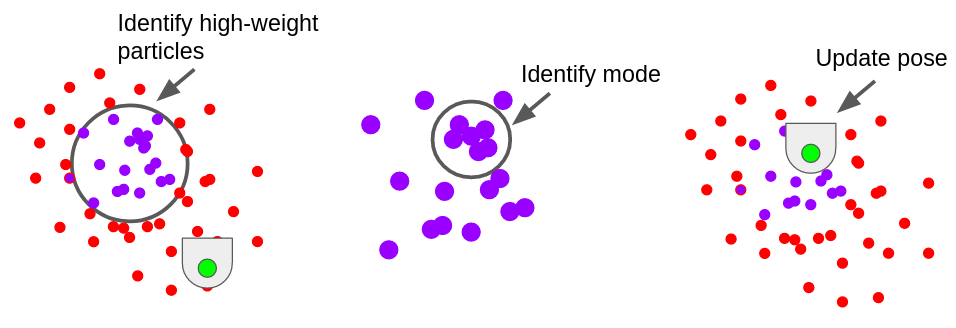
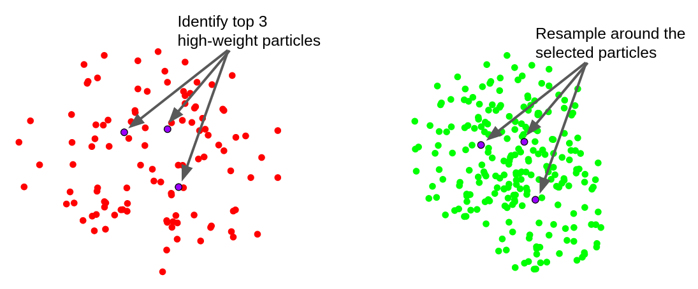

# Computational Intro to Robotics: Robot Localization
Authors: [Mo Ampane](https://github.com/Moampane) & Dokyun Kim

## Project Description
The goal of this project was to implement a particle filter for robot localization using ROS2 in Python.

## Methodology
This project can be separated into 5 main steps  
1. Initializing the particle cloud
2. Updating the particle's location using the robot's odometry
3. Updating the particle's weight using the robot's laser scan data
4. Updating the robot's position based on the particle's weights
5. Resampling the particles

#### Initializing the particle cloud (`initialize_particle_cloud()`)
Before running the particle filter, an initial set of particles must be created. In this project, a 2D gaussian distrubution with $\mu = (0,0)$ and $\sigma = (0.05, 0.05)$ is used to initialize a particle cloud of 300 particles. The plot of the distribution is shown below.  

  
Fig 1. Visualization of the probability distribution used for initializing the particle cloud

$(x,y)$ coordinates of 300 initial particles are selected using this probability distribution. The particles' angles are randomly selected from a range of $0$ to $2\pi$ radians.

#### Update particles with robot's odomoetry (`update_particles_with_odom()`)
LOREM IPSUM

#### Update particles with robot's laser scan (`update_particles_with_laser()`)
LOREM IPSUM

#### Update robot position with particles' weights (`update_robot_pose()`)
Using the weights of updated particles, the robot's new position can be estimated. In this project, a mode-based approach was used, where the mode of high-weight particles determined the robot's new location. The image below shows the updating process.

Fig 2. Visualization of mode-based robot pose updating

A particle is considered *high-weight* if its weight is greater than 0.01. Then, the particles' $(x,y,\theta)$ coordinates are rounded up to 2 decimal places for the purpose of calculating the mode. 

#### Resample particles (`resample_particles()`)
Once the robot's position is updated, a new set of particles need to be sampled to repeat the process. For resampling the particles, the same 2D gaussian distribution used in `initialize_particle_cloud()` is used, but $\mu$ is the $(x,y)$ coordinates of the highest-weight particle. This keeps the highest weight particle in the cloud but replacess every other particle with a new set of 299 particles. The resampling process is shown in the figure below.

Fig 3. Visualization of the resampling process

## Challenges we faced
LOREM IPSUM

## Project Reflection
LOREM IPSUM

