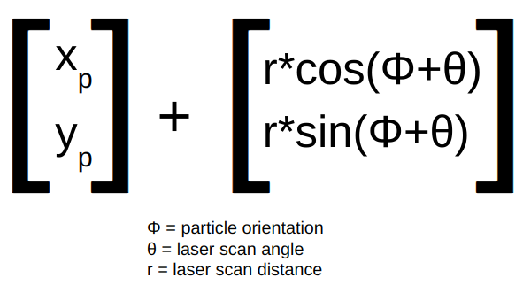

# Computational Intro to Robotics: Robot Localization
Authors: [Mo Ampane](https://github.com/Moampane) & Dokyun Kim

## Project Description
The goal of this project was to implement a particle filter for robot localization using ROS2 in Python.

## Methodology
This project can be separated into 5 main steps  
1. Initializing the particle cloud
2. Updating the particle's location using the robot's odometry
3. Updating the particle's weight using the robot's laser scan data
4. Updating the robot's position based on the particle's weights
5. Resampling the particles

#### Initializing the particle cloud (`initialize_particle_cloud()`)
Before running the particle filter, an initial set of particles must be created. In this project, a 2D gaussian distrubution with $\mu = (0,0)$ and $\sigma = (\sigma _x, \sigma _y)$ is used to initialize a particle cloud of 500 particles. The plot of the distribution is shown below.  

  
Fig 1. Visualization of the probability distribution used for initializing the particle cloud

$(x,y)$ coordinates of 500 initial particles are selected using this probability distribution. The particles' angles are randomly selected from a range of $0$ to $2\pi$ radians.

#### Update particles with robot's odomoetry (`update_particles_with_odom()`)
Once a set of particles is initialized, all of the robot's movements, recorded by the odometry, must be applied to each particle. This is relevant to the weighting of each particle.

Fig 2. Gif of particles being updated by the odometry of the robot

Using matrix multiplication, odometry movements were applied to each particle. The process consisted of bringing the particle to the origin of the odometry frame, applying the odometry transformation matrix, and undoing the transformation of returning the particle to the origin. If t is a time step, multiplying the inverse of the transformation matrix of the robot's pose $(x,y,\theta)$ at tx-1 and the transformation matrix of the robot's pose at tx gives the odometry transformation matrix.

Fig 3. Figure of matrix multiplication process used to make odometry movement transformation matrix

#### Update particles with robot's laser scan (`update_particles_with_laser()`)
Testing each particle's location for similarity to the robot's location requires projecting the robot's laser scan data to each particle. To project the laser scan data onto each particle, each laser scan vector is added to each particle.

Fig 4. Figure of one laser scan point being projected onto one particle

After laser scan data is projected onto a particle, using the helper function 'get_closest_obstacle_distance()' and passing in the x and y of a projected laser scan point as parameters, if a projected point is within 5cm of an obstacle, the particle the projection is coming off increases in weight. This is done for every projected laser scan point of every particle.

Fig 5. Visualization of robot's laser scan and two laser scan projections. Red and blue dots are projected laser scan points from the corresponding red and blue arrows representing particles. The red particle has a higher weight because more of its projected laser scan points are within 5cm of an obstacle while none of the blue particle's projected laser scan points are within 5cm of an obstacle.

#### Update robot position with particles' weights (`update_robot_pose()`)
Using the weights of updated particles, the robot's new position can be estimated. In this project, a mean-based approach was used, where the mean of high-weight particles determined the robot's new location. The image below shows the updating process.

Fig 6. Visualization of mean-based robot pose updating

A particle is considered *high-weight* if its weight is greater than 0.007.

#### Resample particles (`resample_particles()`)
Once the robot's position is updated, a new set of particles need to be sampled for the next iteration. This is done by taking the current particle cloud and using `draw_random_sample()` from `helper_functions.py`. `draw_random_sample()` uses the particles weights as probability of getting resampled.

For the $(x,y,\theta)$ of the resampled particle, a gaussian noise centered on the each particle's $(x,y,\theta)$ to have most particles maintain their original pose while leaving a possibility for variance.

  
Fig 7. Distribution used to add angular noise in particles

## Challenges we faced
The biggest challenge we faced during this project was trying to fine-tune all the different parameters used for the particle filter. The number of particles, particle weights, threshold values for determining if a particle should be considered *high-weight*, etc. Since altering any one of these values drastically affects the outcome, we spent a lot of time tuning these paramters to get the best outcome. In fact, almost half of the given time for this project was used for parameter tuning.

Additionally, implementing 'update_particles_with_odom()' using matrix multiplication was a challenge. Understanding the shift from the odometry frame to an individual particle frame took some time.

Another challenge was getting a solid foundation of the concepts behind particle filters before diving into the project. Since this topic was new to both of us, we spent a lot of time researching the topic before going into the project. There were confusing linear algebra concepts like reference frames and transformtaion matrices that made the project far more challenging than we expected. 

## Project Reflection
Compared to the previous project, this project was definetely more challenging due to the complex ideas behind particle filters. Since most ROS2 aspects like creating publishers/subscribers were already included in the starter code, there was enough time to fully explore the concepts used in implementing the particle filter. Some valuable lessons we learned include testing code in small pieces to verify it works before moving onto the next step, reading code documentation, and using new functions like `matmul`, `random.multivariate_normal`, and `random.exponential` from the NumPy library.

